# PSOC&trade; 4 : LIN slave 

The Local Interconnect Network (LIN) bus was developed to create a standard for low-cost, low-end multiplexed communication. The use of a standard bus protocol promotes the interoperability of network nodes. 

This example demonstrates LIN slave functionality. If the LIN slave receives an unconditional frame from a LIN master with Frame ID 0x10 (InFrame), the first data byte (command) controls two LEDs on the kit.

[View this README on GitHub.](https://github.com/Infineon/mtb-example-ce243029-lin-slave)

[Provide feedback on this code example.](https://yourvoice.infineon.com/jfe/form/SV_1NTns53sK2yiljn?Q_EED=eyJVbmlxdWUgRG9jIElkIjoiQ0UyNDMwMjkiLCJTcGVjIE51bWJlciI6IjAwMi00MzAyOSIsIkRvYyBUaXRsZSI6IlBTT0MmdHJhZGU7IDQgOiBMSU4gc2xhdmUiLCJyaWQiOiJ3YW55dS5saW5AaW5maW5lb24uY29tIiwiRG9jIHZlcnNpb24iOiIxLjAuMCIsIkRvYyBMYW5ndWFnZSI6IkVuZ2xpc2giLCJEb2MgRGl2aXNpb24iOiJNQ0QiLCJEb2MgQlUiOiJBVVRPIiwiRG9jIEZhbWlseSI6IkFVVE8gUFNPQyJ9)

## Requirements

- [ModusToolbox&trade;](https://www.infineon.com/modustoolbox) v3.8 (tested with v3.8)
- Board support package (BSP) minimum required version: 3.1.0
- Programming language: C
- Associated parts: [PSOC&trade; 4000T](https://www.infineon.com/002-33949) and [AUTO PSOC&trade; 4000T](https://www.infineon.com/products/microcontroller/32-bit-psoc-arm-cortex/automotive-psoc-4-mcu)

## Supported toolchains (make variable 'TOOLCHAIN')

- GNU Arm&reg; Embedded Compiler v14.2.1 (`GCC_ARM`) – Default value of `TOOLCHAIN`
- Arm&reg; Compiler v6.22 (`ARM`)
- IAR C/C++ Compiler v9.70.4 (`IAR`)

## Supported kits (make variable 'TARGET')
- [PSOC&trade; 4000T CAPSENSE&trade; Prototyping Kit](https://www.infineon.com/CY8CPROTO-040T) (`CY8CPROTO-040T`)
- [PSOC&trade; 4000T Multi-Sense Prototyping Kit](https://www.infineon.com/CY8CPROTO-040T-MS) (`CY8CPROTO-040T-MS`)
- [AUTO PSOC&trade; 4000T CAPSENSE&trade; Prototyping Kit](https://www.infineon.com/design-resources/finder-selection-tools/evaluation-board) (`CY8CPROTO-040T-AUTO`)

> **Note:** A LIN transceiver is not available on the kits. Thus this application needs [CAN and LIN Shield Kit](https://www.infineon.com/CY8CKIT-026) (`CY8CKIT-026`) as a compatible shield kit to connect the LIN Tx and Rx signals from the PSoC&trade; to a LIN bus or an analyzer.

## Hardware setup

This example uses CY8CPROTO-040T-AUTO (slave) and [PCAN-USB Pro FD](https://www.peak-system.com/products/hardware/external-pc-interfaces/pcan-usb-pro-fd/) connected to a PC (master) as the test setup. Because CY8CPROTO-040T-AUTO does not include a LIN transceiver, it also requires the [CAN and LIN Shield Kit](https://www.infineon.com/CY8CKIT-026) (`CY8CKIT-026`).

   > **Note:** In this code example, the [PCAN-USB Pro FD](https://www.peak-system.com/products/hardware/external-pc-interfaces/pcan-usb-pro-fd/) is used as the master test device. Other devices or tools, such as KIT_PSOC4-HVMS-128K_LITE and the Silicon Engines LIN-USB Converter (Model 9011), can also function as masters. For more details, refer to each device/tool specification.

   > **Note:** This code example uses the [AUTO PSOC&trade; 4000T CAPSENSE&trade; Prototyping Kit](https://www.infineon.com/design-resources/finder-selection-tools/evaluation-board) (`CY8CPROTO-040T-AUTO`) as an example. If users want to use other supportted kits, please refer to each device specification for more details on hardware connection.

   **Figure 1. Hardware connection**
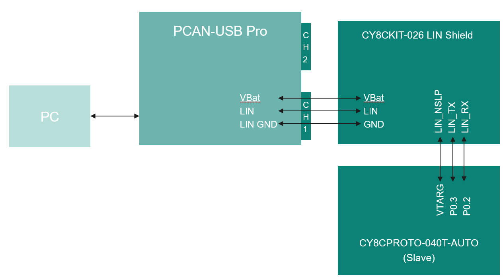

1. There are two LIN transceivers on CY8CKIT-026 (LIN shield). Choose either transceiver (J13/J14 for LIN1 or J5/J6 for LIN2). Connect the master device to the selected transceiver using jumper wires, as shown in **Table 1**.

   **Table 1. Pin connection on PCAN-USB Pro FD (Master) and CY8CKIT-026 (LIN shield)**

   | Components      | PCAN-USB Pro FD (Master)                      | LIN shield (LIN1 transceiver)  | LIN shield (LIN2 transceiver) |
   | --------------- | ----------------------------------------------| -------------------------------| ------------------------------|
   | Jumper          |                                               |                                |                               |
   | VBAT pin        | VBAT-LIN (Pin9)                               | J14_3 (VBAT1)                  | J5_3 (VBAT2)                  |
   | GND pin         | LIN-GND (Pin5 or Pin6)                        | J14_1 (GND)                    | J5_1 (GND)                    |
   | LIN pin         | LIN (Pin4)                                    | J14_2 (LIN1)                   | J5_2 (LIN2)                   |
   | Power           | Connect to PC                                 | 12V adapter                    | 12V adapter                   |

   > **Note:** Make sure jumper J16 is shorted when LIN1 is used, or jumper J7 is shorted when LIN2 is used.


2. CY8CPROTO-040T-AUTO (slave) can be powered from USB. The pin connections are shown in **Table 2**.

   **Table 2. Pin connection on CY8CPROTO-040T-AUTO (slave) and CY8CKIT-026 (LIN shield)**

   | Components      | CY8CPROTO-040T-AUTO (Slave)   | LIN shield (LIN1 transceiver)  | LIN shield (LIN2 transceiver) |
   | --------------- | ------------------------------| -------------------------------| ------------------------------|
   | LINx RX pin     | P0.2                          | J15_1 (LIN1_RX)                | J6_1 (LIN2_RX)                |
   | LINx TX pin     | P0.3                          | J15_2 (LIN1_TX)                | J6_2 (LIN2_TX)                |
   | LINx NSLP pin   | VTARG(5V)                     | J15_3 (LIN1_NSLP)              | J6_3 (LIN2_NSLP)              |
   | GND Pin         | GND                           | GND                            | GND                           |


   > **Note:** Some of the PSOC&trade; 4 kits ship with KitProg2 installed. ModusToolbox&trade; requires KitProg3. Before using this code example, make sure that the board is upgraded to KitProg3. The tool and instructions are available in the [Firmware Loader](https://github.com/Infineon/Firmware-loader) GitHub repository. If you do not upgrade, you will see an error like "unable to find CMSIS-DAP device" or "KitProg firmware is out of date"

## Software setup

Install the [LIN Configurator](https://softwaretools.infineon.com/tools/com.ifx.tb.tool.linconfigurator) 2.0.0 for LIN Slave configuration.

Install the PC software corresponding to the LIN analyzer. In this code example, [PLIN-View Pro](https://www.peak-system.com/products/software/analysis-software/plin-view-pro/) is used.

Program CY8CPROTO-040T-AUTO with this example as the LIN slave.

See the [ModusToolbox&trade; tools package installation guide](https://www.infineon.com/ModusToolboxInstallguide) for information about installing and configuring the tools package.


## Using the code example

### Create the project

The ModusToolbox&trade; tools package provides the Project Creator as both a GUI tool and a command line tool.

<details><summary><b>Use Project Creator GUI</b></summary>

1. Open the Project Creator GUI tool

   There are several ways to do this, including launching it from the dashboard or from inside the Eclipse IDE. For more details, see the [Project Creator user guide](https://www.infineon.com/ModusToolboxProjectCreator) (locally available at *{ModusToolbox&trade; install directory}/tools_{version}/project-creator/docs/project-creator.pdf*).

2. On the **Choose Board Support Package (BSP)** page, select a kit supported by this code example. See [Supported kits](#supported-kits-make-variable-target)

   > **Note:** To use this code example for a kit not listed here, you may need to update the source files. If the kit does not have the required resources, the application may not work

3. On the **Select Application** page:

   a. Select the **Applications(s) Root Path** and the **Target IDE**

      > **Note:** Depending on how you open the Project Creator tool, these fields may be pre-selected for you

   b. Select this code example from the list by enabling its check box

      > **Note:** You can narrow the list of displayed examples by typing in the filter box

   c. (Optional) Change the suggested **New Application Name** and **New BSP Name**

   d. Click **Create** to complete the application creation process

</details>


<details><summary><b>Use Project Creator CLI</b></summary>

The 'project-creator-cli' tool can be used to create applications from a CLI terminal or from within batch files or shell scripts. This tool is available in the *{ModusToolbox&trade; install directory}/tools_{version}/project-creator/* directory.

Use a CLI terminal to invoke the 'project-creator-cli' tool. On Windows, use the command-line 'modus-shell' program provided in the ModusToolbox&trade; installation instead of a standard Windows command-line application. This shell provides access to all ModusToolbox&trade; tools. You can access it by typing "modus-shell" in the search box in the Windows menu. In Linux and macOS, you can use any terminal application.

The following example clones the "[PSOC&trade; LIN Slave communication](https://github.com/Infineon/mtb-example-ce243029-lin-slave)" application with the desired name "LIN Slave communication" configured for the [CY8CPROTO-040T-AUTO](https://www.infineon.com/design-resources/finder-selection-tools/evaluation-board) BSP into the specified working directory, *C:/mtb_projects*:

   ```
   project-creator-cli --board-id CY8CPROTO-040T-AUTO --app-id mtb-example-ce243029-lin-slave --user-app-name LIN Slave communication --target-dir "C:/mtb_projects"
   ```

The 'project-creator-cli' tool has the following arguments:

Argument | Description | Required/optional
---------|-------------|-----------
`--board-id` | Defined in the <id> field of the [BSP](https://github.com/Infineon?q=bsp-manifest&type=&language=&sort=) manifest | Required
`--app-id`   | Defined in the <id> field of the [CE](https://github.com/Infineon?q=ce-manifest&type=&language=&sort=) manifest | Required
`--target-dir`| Specify the directory in which the application is to be created if you prefer not to use the default current working directory | Optional
`--user-app-name`| Specify the name of the application if you prefer to have a name other than the example's default name | Optional

> **Note:** The project-creator-cli tool uses the `git clone` and `make getlibs` commands to fetch the repository and import the required libraries. For details, see the "Project creator tools" section of the [ModusToolbox&trade; tools package user guide](https://www.infineon.com/ModusToolboxUserGuide) (locally available at {ModusToolbox&trade; install directory}/docs_{version}/mtb_user_guide.pdf).

</details>

### Open the project

After the project has been created, you can open it in your preferred development environment.

<details><summary><b>Eclipse IDE</b></summary>

If you opened the Project Creator tool from the included Eclipse IDE, the project will open in Eclipse automatically.

For more details, see the [Eclipse IDE for ModusToolbox&trade; user guide](https://www.infineon.com/MTBEclipseIDEUserGuide) (locally available at *{ModusToolbox&trade; install directory}/docs_{version}/mt_ide_user_guide.pdf*).

</details>

<details><summary><b>Visual Studio (VS) Code</b></summary>

Launch VS Code manually, and then open the generated *{project-name}.code-workspace* file located in the project directory.

For more details, see the [Visual Studio Code for ModusToolbox&trade; user guide](https://www.infineon.com/MTBVSCodeUserGuide) (locally available at *{ModusToolbox&trade; install directory}/docs_{version}/mt_vscode_user_guide.pdf*).

</details>

<details><summary><b>Keil µVision</b></summary>

Double-click the generated *{project-name}.cprj* file to launch the Keil µVision IDE.

For more details, see the [Keil µVision for ModusToolbox&trade; user guide](https://www.infineon.com/MTBuVisionUserGuide) (locally available at *{ModusToolbox&trade; install directory}/docs_{version}/mt_uvision_user_guide.pdf*).

</details>

<details><summary><b>IAR Embedded Workbench</b></summary>

Open IAR Embedded Workbench manually, and create a new project. Then select the generated *{project-name}.ipcf* file located in the project directory.

For more details, see the [IAR Embedded Workbench for ModusToolbox&trade; user guide](https://www.infineon.com/MTBIARUserGuide) (locally available at *{ModusToolbox&trade; install directory}/docs_{version}/mt_iar_user_guide.pdf*).

</details>

<details><summary><b>Command line</b></summary>

If you prefer to use the CLI, open the appropriate terminal, and navigate to the project directory. On Windows, use the command-line 'modus-shell' program; on Linux and macOS, you can use any terminal application. From there, you can run various `make` commands.

For more details, see the [ModusToolbox&trade; tools package user guide](https://www.infineon.com/ModusToolboxUserGuide) (locally available at *{ModusToolbox&trade; install directory}/docs_{version}/mtb_user_guide.pdf*).
</details>

## Operation

1. Connect the board to your PC using the provided USB cable through the KitProg3 USB connector.
2. Connect the **PCAN-USB Pro FD** to your PC.
3. Program LIN slave board.

4. Program the board using one of the following:

   <details><summary><b>Using Eclipse IDE</b></summary>

      a. Select the application project in the Project Explorer

      b. In the **Quick Panel**, scroll down, and click **\<Application Name> Program (KitProg3_MiniProg4)**
   </details>


   <details><summary><b>In other IDEs</b></summary>

   Follow the instructions in your preferred IDE

   </details>


   <details><summary><b>Using CLI</b></summary>

     From the terminal, execute the `make program` command to build and program the application using the default toolchain to the default target. The default toolchain is specified in the application's Makefile but you can override this value manually:
      ```
      make program TOOLCHAIN=<toolchain>
      ```

      Example:
      ```
      make program TOOLCHAIN=GCC_ARM
      ```
   </details>

5. After programming, the application starts automatically

6. Open **PLIN-View Pro** and connect to **PCAN-USB Pro FD**. Click the **LIN** tab, then click **Connect** to open the settings, as shown in **Figure 2**. Select the connected hardware channel. Set **Mode** to **Master** and **Bit rate** to **19200 bps**, then click **OK**, as shown in **Figure 3**.

      **Figure 2. Open PLIN-View Pro setting**
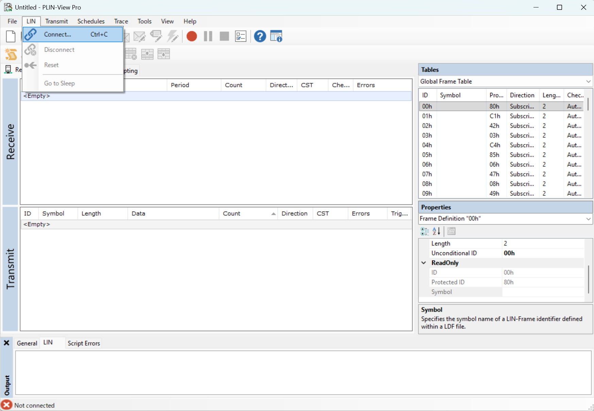

   **Figure 3. PLIN-View Pro connection and configurations**
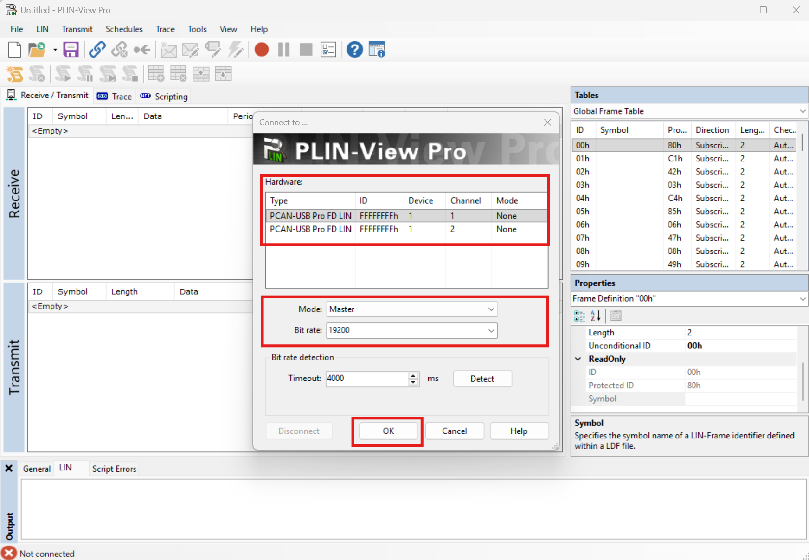

7. Click **Transmit** to set up a **New Frame**, as shown in **Figure 4**. Add the message to be transmitted to the slave and send it through the analyzer, as shown in **Figure 5**.

   **Figure 4. Setup New Frame**
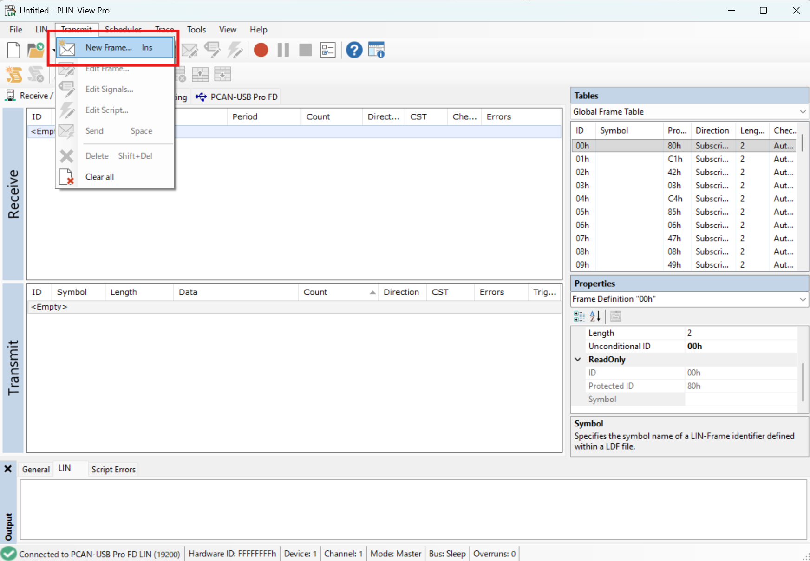

   **Figure 5. Adding and sending message using PLIN-View Pro**
            
         Frame ID 0x10 (InFrame)
            - Master sends LED command to slave:
               - Command 0x00
               - Command 0x11
               - Command 0x22
               - Command 0x33   
   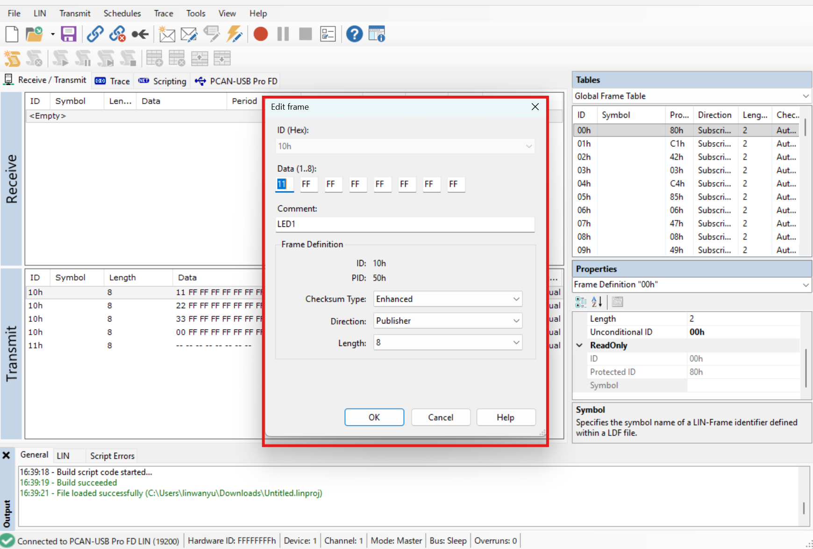

   **Figure 6. The Master message**
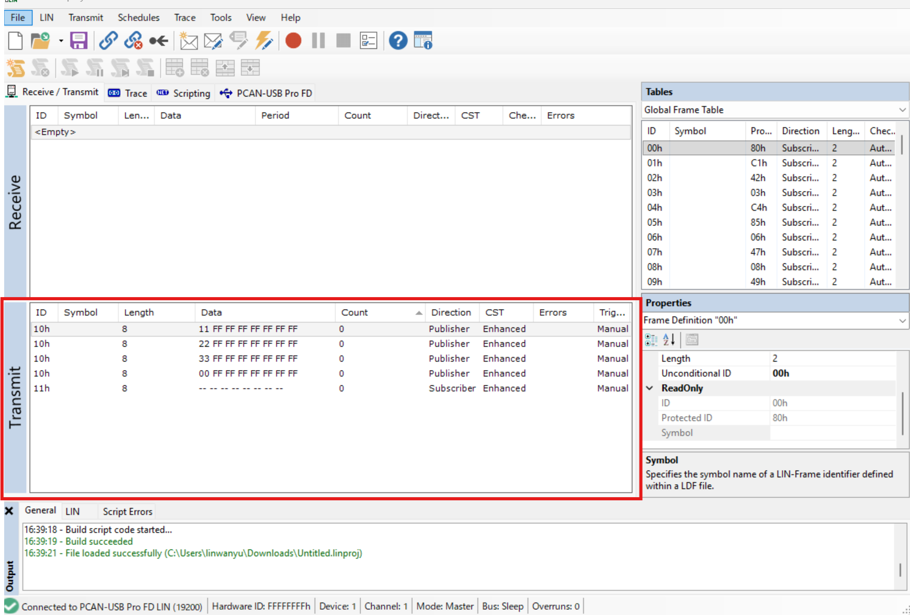

8. Send the message as shown in **Figure 7**.

   **Figure 7. Send the message**
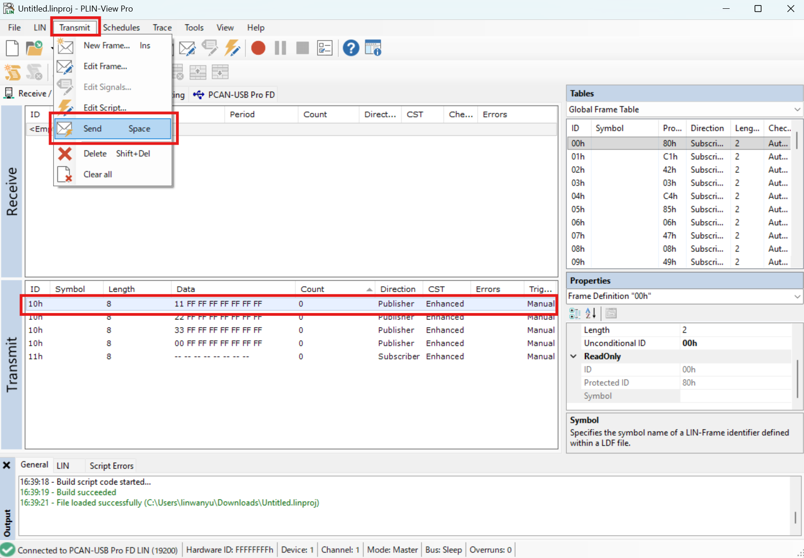

9. If a frame with ID = 0x10 is received from the master (analyzer), the slave controls the LEDs based on the received data command from the master as shown in **Table 3**. 

    **Table 3. Slave response per commands from master**

   | Command   | Slave response                              |
   | ------    | ------                                      |
   | 0x11      | Turns on LED2; Turns off LED3 on board      |
   | 0x22      | Turns off LED2; Turns on LED3 on board      |
   | 0x33      | Turns on LED2 and LED3 on board             |
   | 0x00      | Turns off LED2 and LED3 on board            |

10. If a frame with ID = 0x11 is received from the master (analyzer), then the slave sends the status of baseboard LEDs back to the master as shown in **Table 4**. 

      **Table 4. LED status**

      | LED status on CY8CPROTO-040T-AUTO (Slave)   | Data byte |
      | ------                                      | ------    |
      | LED2 on board                               | 0xAA      |
      | LED3 on board                               | 0xBB      |
      | All LEDs on                                 | 0xCC      |
      | All LEDs off                                | 0xDD      |

      **Note**: In this example, CY8CPROTO-040T-AUTO (Slave) sends the status of previously received command as the first byte and the current status of LEDs as the second byte.

11. The transmitted and received data in the LIN analyzer are shown in **Figure 8**.

      **Figure 8. Results at LIN analyzer**
      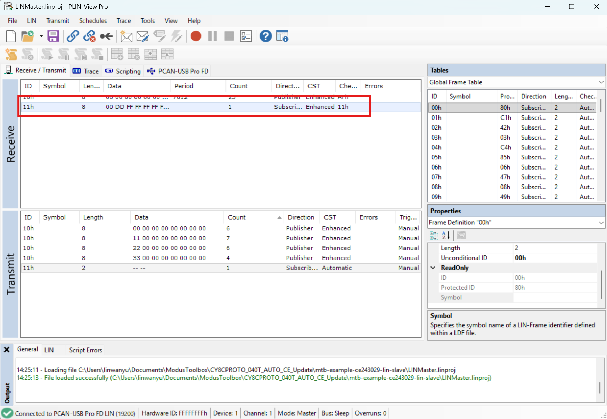

      **Note**: In this example, CY8CPROTO-040T-AUTO (Slave) sends the status of previously received command as the first byte and the current status of LEDs as the second byte.


## Debugging

You can debug the example to step through the code.

<details><summary><b>In Eclipse IDE</b></summary>

Use the **\<Application Name> Debug (KitProg3_MiniProg4)** configuration in the **Quick Panel**. For details, see the "Program and debug" section in the [Eclipse IDE for ModusToolbox&trade; user guide](https://www.infineon.com/MTBEclipseIDEUserGuide).

</details>

<details><summary><b>In other IDEs</b></summary>

Follow the instructions in your preferred IDE.
</details>
<br>

## Design and implementation

This design uses the LIN Configurator 2.0 and Device Configurator. The initialization of LIN slave is configured by the LIN Configurator 2.0 and its hardware configuration for the LIN slave, such as GPIO and clock assignments, is done by the Device Configurator.

In this example, the LIN master sends frames to control the LEDs on the LIN slave device, and reads back the LED status.

  **Frame ID 0x10 (InFrame)**
  - Master sends LED command to slave:
      - Command 0x00 --> LED2 LED3 LEDs OFF on the slave kit
      - Command 0x11 --> LED2 ON on the slave kit
      - Command 0x22 --> LED3 ON on the slave kit
      - Command 0x33 --> LED2 LED3 LEDs ON the slave kit

  **Frame ID 0x11 (OutFrame)** 
  - Master reads LED status from slave:
      - If LED2 ON --> 0xAA
      - If LED3 ON --> 0xBB
      - If All LEDs ON --> 0xCC
      - If All LEDs OFF --> 0xDD

The following figures show the LIN configurator 2.0 generated by the LIN Configurator.

For more details, see the [LIN configurator user guide](https://documentation.infineon.com/modustoolbox/docs/modustoolbox-lin-configurator-user-guide). 

**Figure 9. LIN general settings**

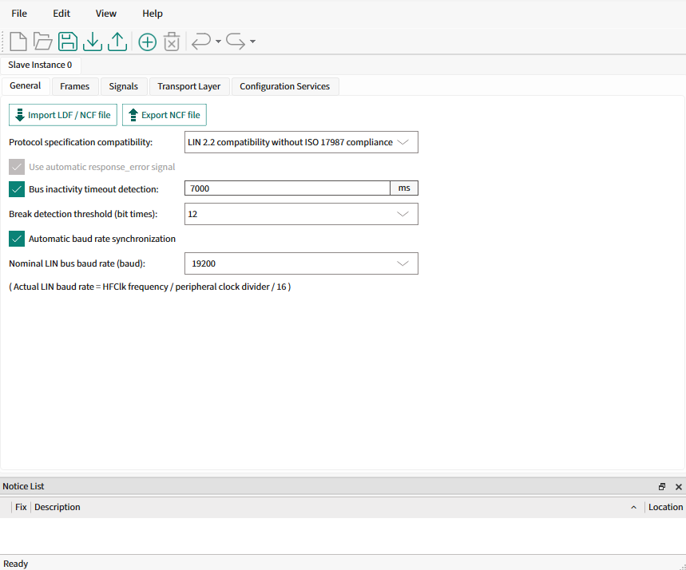

**Figure 10. LIN frame settings**

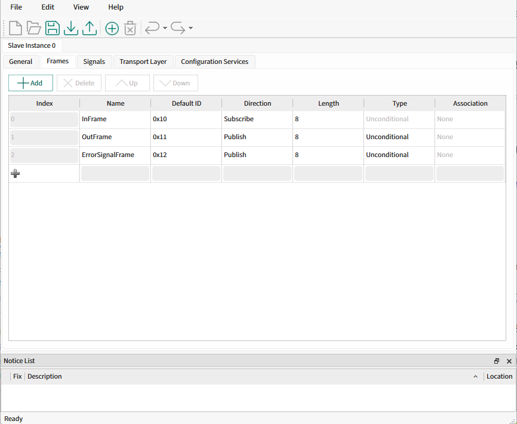

**Figure 11. LIN signal settings**

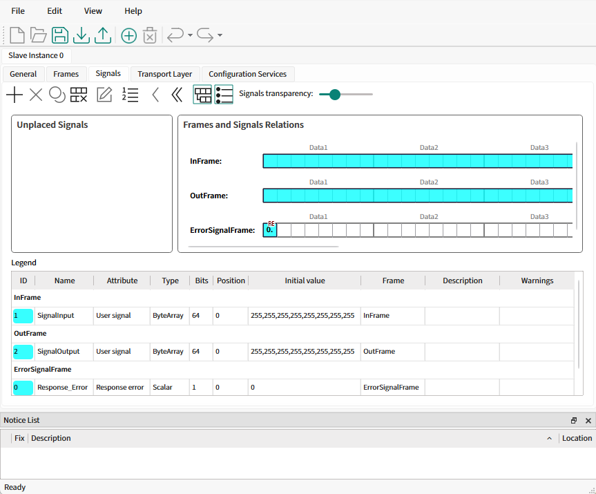

## Resources and settings

**Table 5. Application resources**

| Resource         |  Alias/object          |    Purpose                              |
| :-------         | :------------          | :------------                           |
| GPIO (PDL)       | CYBSP_USER_LED2        | User LED to show the LIN communication  | 
|                  | CYBSP_USER_LED3        | User LED to show the LIN communication  | 

<br>

## Related resources

Resources  | Links
-----------|----------------------------------
Application notes  | [AN0034](https://www.infineon.com/row/public/documents/10/42/infineon-an0034-getting-started-with-psoc-4-hv-ms-mcus-in-modustoolbox-applicationnotes-en.pdf) - Getting started with PSOC&trade; 4 HV MS and PSOC&trade; 4 HV PA MCUs in ModusToolbox&trade;
Code examples  | [Using ModusToolbox&trade;](https://github.com/Infineon/Code-Examples-for-ModusToolbox-Software) on GitHub
Device documentation |[AUTO PSOC&trade; 4000T datasheets](https://www.infineon.com/products/microcontroller/32-bit-psoc-arm-cortex/automotive-psoc-4-mcu#documents) <br>[AUTO PSOC&trade; 4000T technical reference manuals](https://www.infineon.com/products/microcontroller/32-bit-psoc-arm-cortex/automotive-psoc-4-mcu#documents) 
Development kits | Select your kits from the [Evaluation board finder](https://www.infineon.com/cms/en/design-support/finder-selection-tools/product-finder/evaluation-board) page.
Libraries on GitHub | [mtb-pdl-cat2](https://github.com/Infineon/mtb-pdl-cat2) – PSOC&trade; 4 Peripheral Driver Library (PDL)<br>
Tools  | [ModusToolbox&trade;](https://www.infineon.com/modustoolbox) – ModusToolbox&trade; software is a collection of easy-to-use libraries and tools enabling rapid development with Infineon MCUs for applications ranging from wireless and cloud-connected systems, edge AI/ML, embedded sense and control, to wired USB connectivity using PSOC&trade; Industrial/IoT MCUs, AIROC&trade; Wi-Fi and Bluetooth&reg; connectivity devices, XMC&trade; Industrial MCUs, and EZ-USB&trade;/EZ-PD&trade; wired connectivity controllers. ModusToolbox&trade; incorporates a comprehensive set of BSPs, HAL, libraries, configuration tools, and provides support for industry-standard IDEs to fast-track your embedded application development<br>[PCAN-USB Pro FD](https://www.peak-system.com/products/hardware/external-pc-interfaces/pcan-usb-pro-fd/) - The PCAN-USB Pro FD adapter enables the connection of CAN FD and LIN networks to a computer via USB. Two field buses can be connected at the same time, up to four with appropriate adapter cables (2 x CAN FD, 2 x LIN). Each CAN FD channel is separately isolated against USB and LIN with a maximum of 500 Volts. Its robust aluminum casing makes the PCAN-USB Pro FD adapter suitable for mobile applications.
<br>

## Other resources

Infineon provides a wealth of data at [www.infineon.com](https://www.infineon.com) to help you select the right device, and quickly and effectively integrate it into your design.

## Document history

Document title: *CE243029 - PSOC&trade; 4: LIN Slave*

 | Version | Description of change |
 | ------- | --------------------- |
 | 1.0.0   | New code example      |

<br>

All referenced product or service names and trademarks are the property of their respective owners.

The Bluetooth&reg; word mark and logos are registered trademarks owned by Bluetooth SIG, Inc., and any use of such marks by Infineon is under license.

PSOC&trade;, formerly known as PSoC&trade;, is a trademark of Infineon Technologies. Any references to PSoC&trade; in this document or others shall be deemed to refer to PSOC&trade;.

---------------------------------------------------------

(c) 2026, Infineon Technologies AG, or an affiliate of Infineon Technologies AG. All rights reserved.
This software, associated documentation and materials ("Software") is owned by Infineon Technologies AG or one of its affiliates ("Infineon") and is protected by and subject to worldwide patent protection, worldwide copyright laws, and international treaty provisions. Therefore, you may use this Software only as provided in the license agreement accompanying the software package from which you obtained this Software. If no license agreement applies, then any use, reproduction, modification, translation, or compilation of this Software is prohibited without the express written permission of Infineon.
<br>
Disclaimer: UNLESS OTHERWISE EXPRESSLY AGREED WITH INFINEON, THIS SOFTWARE IS PROVIDED AS-IS, WITH NO WARRANTY OF ANY KIND, EXPRESS OR IMPLIED, INCLUDING, BUT NOT LIMITED TO, ALL WARRANTIES OF NON-INFRINGEMENT OF THIRD-PARTY RIGHTS AND IMPLIED WARRANTIES SUCH AS WARRANTIES OF FITNESS FOR A SPECIFIC USE/PURPOSE OR MERCHANTABILITY. Infineon reserves the right to make changes to the Software without notice. You are responsible for properly designing, programming, and testing the functionality and safety of your intended application of the Software, as well as complying with any legal requirements related to its use. Infineon does not guarantee that the Software will be free from intrusion, data theft or loss, or other breaches (“Security Breaches”), and Infineon shall have no liability arising out of any Security Breaches. Unless otherwise explicitly approved by Infineon, the Software may not be used in any application where a failure of the Product or any consequences of the use thereof can reasonably be expected to result in personal injury.
